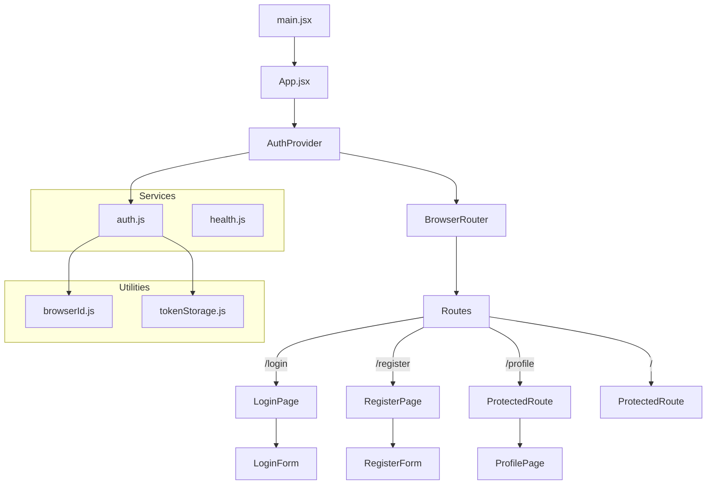
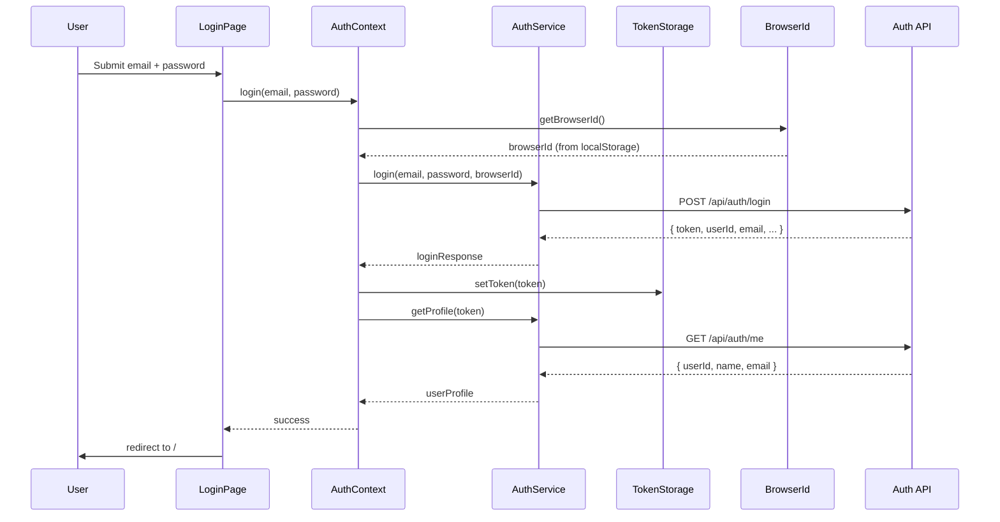
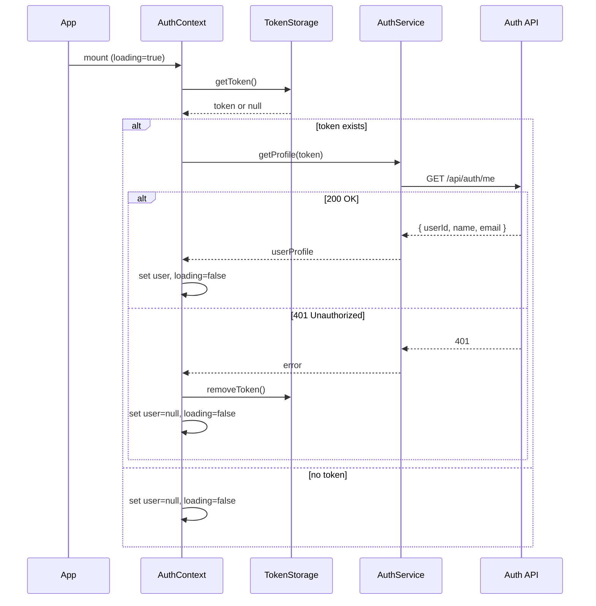

# Design Document: auth-integration

## Overview

This design describes the integration of the Authentication API (#[[file:auth-api.md]]) into the existing Vite + React frontend. The integration adds user registration, login with browser-aware session management, token-based authentication, protected routes, and a user profile page. The auth API runs at a separate base URL (`VITE_AUTH_BASE_URL`) from the existing health-check backend (`VITE_BASE_URL`).

Key design decisions:
- **Separate auth service module** (`src/services/auth.js`) mirrors the existing `health.js` pattern — one file per API domain.
- **Utility modules** for browser ID and token storage keep localStorage concerns isolated from components.
- **React Context** (`AuthContext`) provides global auth state so any component can access the current user and auth actions without prop drilling.
- **ProtectedRoute wrapper** uses `AuthContext` to gate access, redirecting unauthenticated users to `/login`.
- **401 interceptor** is handled inside `AuthContext` — when any auth service call returns 401, the context clears state and triggers a redirect.

## Architecture



### Data Flow — Login



### Data Flow — Session Restoration on App Load



## Components and Interfaces

### Auth Service (`src/services/auth.js`)

Centralized module for all authentication API calls. Reads `VITE_AUTH_BASE_URL` from `import.meta.env`. Follows the same pattern as the existing `health.js` service.

```js
const AUTH_BASE_URL = import.meta.env.VITE_AUTH_BASE_URL;

/**
 * @param {string} name
 * @param {string} email
 * @param {string} password
 * @returns {Promise<{ userId: number, email: string, message: string }>}
 * @throws {{ error: string, message: string }} on non-success response
 */
export async function register(name, email, password) { /* ... */ }

/**
 * @param {string} email
 * @param {string} password
 * @param {string} browserId
 * @returns {Promise<{ userId: number, email: string, token: string, expiryDate: string, sameBrowserReuse: boolean }>}
 * @throws {{ error: string, message: string }} on non-success response
 */
export async function login(email, password, browserId) { /* ... */ }

/**
 * @param {string} token
 * @returns {Promise<{ userId: number, name: string, email: string }>}
 * @throws {{ error: string, message: string }} on non-success response
 */
export async function getProfile(token) { /* ... */ }

/**
 * @param {string} token
 * @returns {Promise<{ message: string }>}
 * @throws {{ error: string, message: string }} on non-success response
 */
export async function logout(token) { /* ... */ }
```

Error handling pattern (shared across all functions):
```js
if (!response.ok) {
  const body = await response.json();
  const err = new Error(body.message);
  err.code = body.error;
  err.status = response.status;
  throw err;
}
```

### Browser ID Utility (`src/utils/browserId.js`)

Manages a stable UUID per browser instance in localStorage.

```js
const BROWSER_ID_KEY = 'browser_id';

/**
 * Returns the existing browser ID from localStorage, or generates a new UUID and stores it.
 * @returns {string} UUID string
 */
export function getBrowserId() { /* ... */ }
```

Uses `crypto.randomUUID()` for UUID generation (supported in all modern browsers and jsdom for tests).

### Token Storage Utility (`src/utils/tokenStorage.js`)

Thin wrapper around localStorage for the auth token.

```js
const TOKEN_KEY = 'auth_token';

/** @returns {string | null} */
export function getToken() { /* ... */ }

/** @param {string} token */
export function setToken(token) { /* ... */ }

export function removeToken() { /* ... */ }
```

### AuthContext Provider (`src/context/AuthContext.jsx`)

React context that holds auth state and exposes auth actions to the component tree.

```js
/**
 * @typedef {Object} AuthContextValue
 * @property {{ userId: number, name: string, email: string } | null} user
 * @property {boolean} isAuthenticated
 * @property {boolean} loading
 * @property {(email: string, password: string) => Promise<void>} login
 * @property {(name: string, email: string, password: string) => Promise<{ userId: number, email: string, message: string }>} register
 * @property {() => Promise<void>} logout
 * @property {() => Promise<void>} fetchProfile
 */
```

Key behaviors:
- On mount, checks `getToken()`. If a token exists, calls `getProfile(token)` to restore the session. Sets `loading = false` when done.
- `login(email, password)`: calls `getBrowserId()`, then `authService.login(email, password, browserId)`, stores the token via `setToken()`, fetches the profile, and updates `user` state.
- `register(name, email, password)`: calls `authService.register(name, email, password)` and returns the result. Does NOT auto-login (the API doesn't return a token on registration).
- `logout()`: calls `authService.logout(token)`, then `removeToken()`, sets `user = null`.
- 401 handling: if `getProfile` or `logout` throws with `status === 401`, the context calls `removeToken()`, sets `user = null`. Navigation to `/login` is handled by the consuming component or `ProtectedRoute`.

### useAuth Hook

```js
/**
 * @returns {AuthContextValue}
 */
export function useAuth() {
  return useContext(AuthContext);
}
```

### ProtectedRoute (`src/components/ProtectedRoute.jsx`)

Route wrapper that gates access based on auth state.

```js
/**
 * Renders children if authenticated, shows loading indicator while session is restoring,
 * or redirects to /login if unauthenticated.
 */
export default function ProtectedRoute({ children }) { /* ... */ }
```

Uses `useAuth()` to read `loading` and `isAuthenticated`. Uses `<Navigate to="/login" />` for redirects.

### LoginPage (`src/pages/LoginPage.jsx`) — Updated

The existing LoginPage already renders `LoginForm` when the health check passes. The update wires `onSubmit` to `useAuth().login()` and adds error display and navigation.

Changes:
- Import `useAuth` and `useNavigate`
- On form submit: call `login(email, password)`, on success navigate to `/`
- Display error messages based on error code (`INVALID_CREDENTIALS`, `USER_ALREADY_LOGGED_IN_ANOTHER_BROWSER`, etc.)
- Add a link to `/register`

### RegisterPage (`src/pages/RegisterPage.jsx`)

New page component at `/register`.

- Renders `RegisterForm`
- On submit: calls `useAuth().register(name, email, password)`
- On success: navigates to `/login` with a success message (via `useNavigate` with state or query param)
- Displays error messages for `EMAIL_ALREADY_EXISTS`, `VALIDATION_ERROR`, `INTERNAL_ERROR`
- Includes a link to `/login`

### RegisterForm (`src/components/RegisterForm.jsx`)

Presentational form component with name, email, and password fields.

```js
/**
 * @param {{ onSubmit: (name: string, email: string, password: string) => void }} props
 */
export default function RegisterForm({ onSubmit }) { /* ... */ }
```

### ProfilePage (`src/pages/ProfilePage.jsx`)

Protected page at `/profile` that displays the current user's info and a logout button.

- Uses `useAuth()` to read `user` and `logout`
- Displays `user.name` and `user.email`
- Logout button calls `logout()`, then navigates to `/login`

### App.jsx — Updated

Updated routing configuration:

```jsx
<AuthProvider>
  <BrowserRouter>
    <Routes>
      <Route path="/login" element={<LoginPage />} />
      <Route path="/register" element={<RegisterPage />} />
      <Route path="/profile" element={
        <ProtectedRoute><ProfilePage /></ProtectedRoute>
      } />
      <Route path="/" element={
        <ProtectedRoute>{/* future home page */}</ProtectedRoute>
      } />
    </Routes>
  </BrowserRouter>
</AuthProvider>
```

`AuthProvider` wraps `BrowserRouter` so that auth state is available to all route components and `ProtectedRoute` can access the context.

## Data Models

### API Request/Response Types

```js
/** Register Request */
// { name: string, email: string, password: string }

/** Register Response (200) */
// { userId: number, email: string, message: string }

/** Login Request */
// { email: string, password: string, browserId: string }

/** Login Response (200) */
// { userId: number, email: string, token: string, expiryDate: string, sameBrowserReuse: boolean }

/** Profile Response (200) */
// { userId: number, name: string, email: string }

/** Logout Response (200) */
// { message: string }

/** Error Response (4xx/5xx) */
// { error: string, message: string }
```

### Auth Context State

```js
/**
 * @typedef {Object} AuthState
 * @property {{ userId: number, name: string, email: string } | null} user - Current user profile or null
 * @property {boolean} isAuthenticated - true when user is not null
 * @property {boolean} loading - true during initial session restoration
 */
```

### localStorage Keys

| Key | Value | Purpose |
|-----|-------|---------|
| `auth_token` | UUID string | Auth token from login response |
| `browser_id` | UUID string | Stable browser identifier for session management |

### Environment Variables

| Variable | Description | Example |
|----------|-------------|---------|
| `VITE_BASE_URL` | Health-check backend base URL (existing) | `http://localhost:3000` |
| `VITE_AUTH_BASE_URL` | Auth API base URL (new) | `http://localhost:8080` |


## Correctness Properties

*A property is a characteristic or behavior that should hold true across all valid executions of a system — essentially, a formal statement about what the system should do. Properties serve as the bridge between human-readable specifications and machine-verifiable correctness guarantees.*

### Property 1: Auth service request construction

*For any* valid inputs (random strings for name, email, password, browserId, token), calling the corresponding auth service function (`register`, `login`, `getProfile`, `logout`) should produce a `fetch` call with the correct URL (`{VITE_AUTH_BASE_URL}/api/auth/...`), HTTP method (POST or GET), `Content-Type: application/json` header (for POST), `auth-token` header (for authenticated endpoints), and JSON body containing exactly the expected fields.

**Validates: Requirements 1.1, 1.2, 1.3, 1.4, 1.5**

### Property 2: Auth service error parsing

*For any* non-success HTTP status code (400–599) and any error response body containing `error` and `message` string fields, calling any auth service function should throw an error object whose `code` property equals the response `error` field and whose `message` property equals the response `message` field.

**Validates: Requirements 1.6**

### Property 3: Browser ID idempotence

*For any* UUID string stored in localStorage under the `browser_id` key, calling `getBrowserId()` any number of times should always return that same UUID without modifying localStorage.

**Validates: Requirements 2.2**

### Property 4: Token storage round trip

*For any* non-empty token string, calling `setToken(token)` followed by `getToken()` should return the exact same token string. Additionally, calling `removeToken()` followed by `getToken()` should return `null`.

**Validates: Requirements 3.1, 3.2, 3.3**

### Property 5: isAuthenticated invariant

*For any* auth context state, the `isAuthenticated` value should equal `user !== null`. When `user` is a valid profile object, `isAuthenticated` is `true`; when `user` is `null`, `isAuthenticated` is `false`.

**Validates: Requirements 4.1, 4.2**

### Property 6: Login then profile consistency

*For any* successful login response containing a token and a subsequent successful getProfile response, after the AuthContext `login` function completes, the context `user` state should match the profile returned by `getProfile`, and `getToken()` should return the token from the login response.

**Validates: Requirements 3.1, 4.5**

### Property 7: Logout clears all auth state

*For any* authenticated state (user is not null, token exists in localStorage), after the AuthContext `logout` function completes successfully, the context `user` should be `null`, `isAuthenticated` should be `false`, and `getToken()` should return `null`.

**Validates: Requirements 3.2, 4.6**

### Property 8: ProtectedRoute gates on auth state

*For any* React component wrapped by `ProtectedRoute`, when `isAuthenticated` is `false` and `loading` is `false`, the component should not be rendered and the user should be redirected to `/login`. When `isAuthenticated` is `true`, the wrapped component should be rendered.

**Validates: Requirements 7.1, 7.3**

### Property 9: 401 response clears auth state

*For any* authenticated auth service call (`getProfile`, `logout`) that receives a 401 HTTP response, the AuthContext should remove the token from localStorage and set the user state to `null`.

**Validates: Requirements 8.1, 8.2**

## Error Handling

| Scenario | Error Code | Behavior |
|----------|-----------|----------|
| Invalid credentials on login | `INVALID_CREDENTIALS` (401) | Display "Invalid email or password" on LoginPage |
| Active session in another browser | `USER_ALREADY_LOGGED_IN_ANOTHER_BROWSER` (403) | Display "Already logged in from another browser" on LoginPage |
| Duplicate email on register | `EMAIL_ALREADY_EXISTS` (409) | Display "Email is already registered" on RegisterPage |
| Validation error | `VALIDATION_ERROR` (400) | Display the API error message on the relevant page |
| Server error | `INTERNAL_ERROR` (500) | Display the API error message on the relevant page |
| Expired/invalid token on any request | `UNAUTHORIZED` (401) | Clear token, clear user state, redirect to `/login` |
| Network failure | N/A | Catch the fetch error, display a generic network error message |

All auth service functions throw structured errors with `code`, `message`, and `status` properties. Page components catch these errors and display appropriate messages based on the `code` field.

The 401 handler in AuthContext ensures that token expiry or invalidation is handled consistently — the user is always returned to the login page with a clean state.

## Testing Strategy

### Testing Libraries

- **Unit/Integration tests**: Vitest + React Testing Library (`@testing-library/react`)
- **Property-based tests**: [fast-check](https://github.com/dubzzz/fast-check) (already in devDependencies)
- **Test environment**: jsdom (configured in `vite.config.js`)

### Unit Tests

Unit tests cover specific examples, edge cases, and integration points:

**Auth Service (`src/services/__tests__/auth.test.js`)**
- `register()` sends correct request and returns parsed response on 200
- `login()` sends correct request and returns parsed response on 200
- `getProfile()` sends GET with auth-token header and returns profile on 200
- `logout()` sends POST with auth-token header and returns message on 200
- Each function throws structured error on 409, 401, 403, 400, 500
- Each function throws on network failure

**Browser ID (`src/utils/__tests__/browserId.test.js`)**
- Generates and stores UUID when none exists
- Returns existing UUID when one exists
- Generated value is a valid UUID format

**Token Storage (`src/utils/__tests__/tokenStorage.test.js`)**
- `setToken` / `getToken` round trip
- `removeToken` clears the token
- `getToken` returns null when no token stored

**AuthContext (`src/context/__tests__/AuthContext.test.jsx`)**
- Restores session from localStorage token on mount
- Sets loading=true during restoration, false after
- login() stores token and fetches profile
- logout() clears token and user
- register() does not auto-login
- Handles 401 during session restoration (clears state)

**LoginPage (`src/pages/__tests__/LoginPage.test.jsx`)**
- Submitting form calls login with email and password
- Redirects to / on success
- Shows error for INVALID_CREDENTIALS
- Shows error for USER_ALREADY_LOGGED_IN_ANOTHER_BROWSER
- Shows link to /register

**RegisterPage (`src/pages/__tests__/RegisterPage.test.jsx`)**
- Renders name, email, password fields
- Submitting form calls register
- Redirects to /login with success message on success
- Shows error for EMAIL_ALREADY_EXISTS
- Shows link to /login

**ProtectedRoute (`src/components/__tests__/ProtectedRoute.test.jsx`)**
- Redirects to /login when unauthenticated
- Renders children when authenticated
- Shows loading indicator while loading

**ProfilePage (`src/pages/__tests__/ProfilePage.test.jsx`)**
- Displays user name and email
- Logout button calls logout and redirects to /login

### Property-Based Tests

Each property test runs a minimum of 100 iterations using fast-check. Each test references its design property.

- **Test 1** — Feature: auth-integration, Property 1: Auth service request construction
  Generate random strings for all parameters using `fc.string()`. Mock `fetch` to return a success response. Call each auth service function and assert the `fetch` call has the correct URL, method, headers, and body fields.

- **Test 2** — Feature: auth-integration, Property 2: Auth service error parsing
  Generate random HTTP status codes in 400–599 using `fc.integer({min:400, max:599})` and random `{error, message}` objects using `fc.record({error: fc.string(), message: fc.string()})`. Mock `fetch` to return that status and body. Call each auth service function and assert the thrown error has matching `code` and `message`.

- **Test 3** — Feature: auth-integration, Property 3: Browser ID idempotence
  Generate random UUID strings using `fc.uuid()`. Set localStorage `browser_id` to the generated UUID. Call `getBrowserId()` twice and assert both calls return the original UUID and localStorage is unchanged.

- **Test 4** — Feature: auth-integration, Property 4: Token storage round trip
  Generate random non-empty strings using `fc.string({minLength:1})`. Call `setToken(s)`, assert `getToken() === s`. Call `removeToken()`, assert `getToken() === null`.

- **Test 5** — Feature: auth-integration, Property 5: isAuthenticated invariant
  Generate random user objects (or null) using `fc.option(fc.record({userId: fc.nat(), name: fc.string(), email: fc.string()}))`. Render AuthContext with the generated user state and assert `isAuthenticated === (user !== null)`.

- **Test 6** — Feature: auth-integration, Property 6: Login then profile consistency
  Generate random login responses and profile responses. Mock fetch to return them in sequence. Call AuthContext `login()` and assert the resulting `user` matches the profile response and `getToken()` returns the login token.

- **Test 7** — Feature: auth-integration, Property 7: Logout clears all auth state
  Generate random tokens and user profiles. Set up authenticated state, call `logout()`, and assert `user === null`, `isAuthenticated === false`, `getToken() === null`.

- **Test 8** — Feature: auth-integration, Property 8: ProtectedRoute gates on auth state
  Generate random boolean pairs for `{isAuthenticated, loading}`. Render ProtectedRoute with a test child component. Assert: if `loading`, show loading indicator; if `!isAuthenticated && !loading`, redirect to /login; if `isAuthenticated && !loading`, render child.

- **Test 9** — Feature: auth-integration, Property 9: 401 response clears auth state
  Generate random tokens. Set up authenticated state with the token. Mock fetch to return 401 for getProfile. Call fetchProfile and assert token is removed and user is null.
