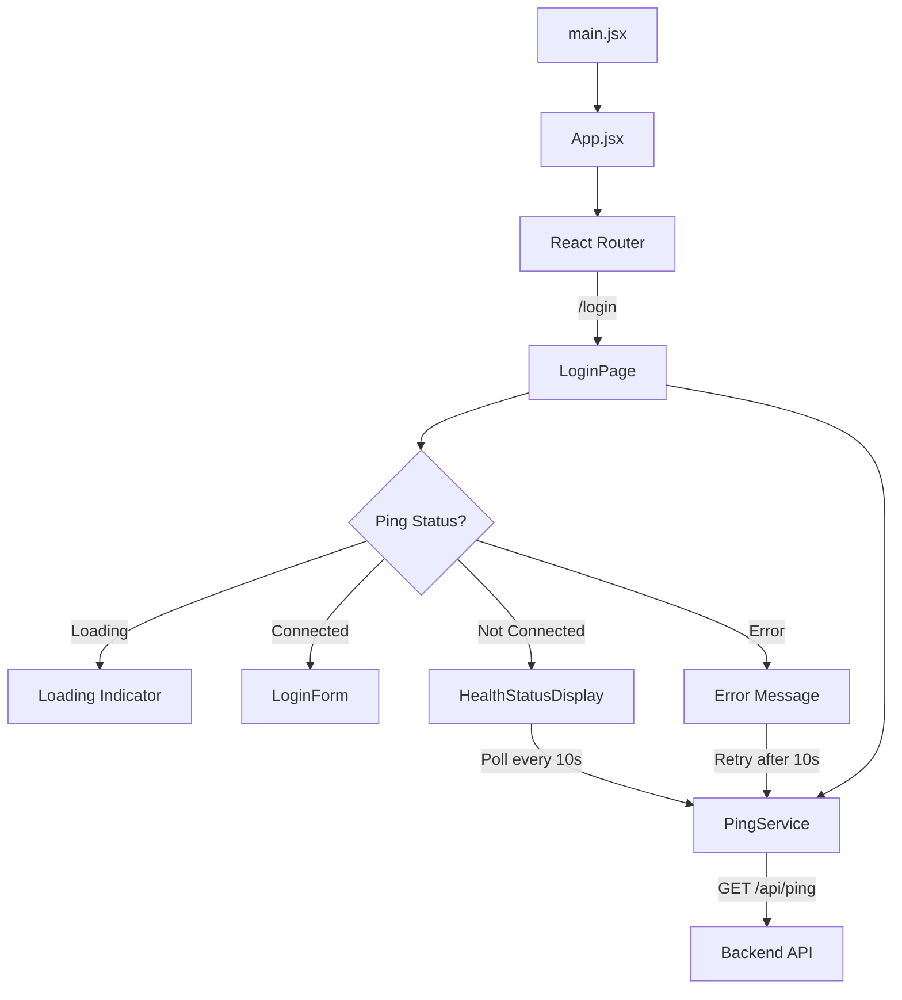
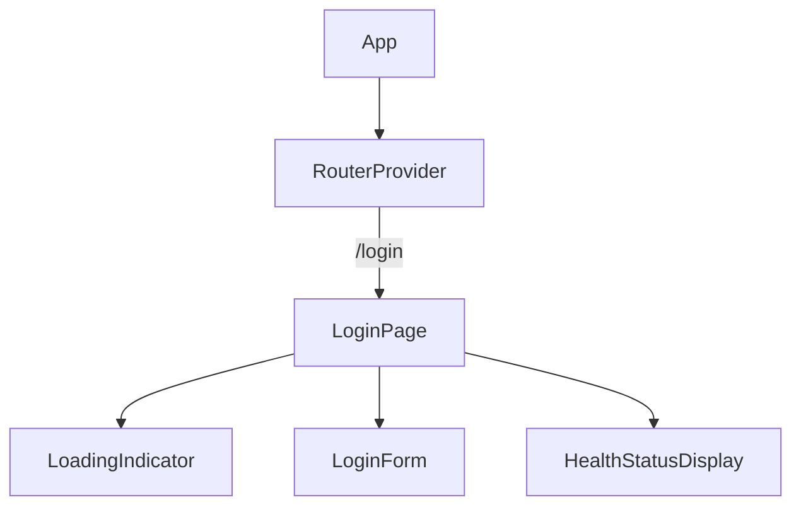

# Design Document: dashboard-analyser-web

## Overview

This design describes a React SPA built with Vite that provides a login page with backend health verification. When the user navigates to `/login`, the app calls a ping endpoint to check database connectivity. If the database is connected, a login form is shown. Otherwise, the current status is displayed and the app polls every 10 seconds until the backend is healthy.

The application uses React Router for client-side routing, organizes code into `pages/`, `services/`, and `components/` directories, and reads the backend base URL from the `VITE_BASE_URL` environment variable.

## Architecture



### Component Tree



### Data Flow

1. `LoginPage` mounts → calls `PingService.ping()`
2. While awaiting response → render loading indicator
3. On success with `databaseStatus === "connected"` → render `LoginForm`
4. On success with other status → render `HealthStatusDisplay`, start 10s polling interval
5. On network/HTTP error → render error message, retry after 10s
6. When polling returns `"connected"` → stop polling, render `LoginForm`

## Components and Interfaces

### PingService (`src/services/health.js`)

Responsible for calling the backend health endpoint. Reads `VITE_BASE_URL` from `import.meta.env`.

```js
// src/services/health.js

const BASE_URL = import.meta.env.VITE_BASE_URL;

/**
 * @returns {Promise<{ appName: string, appVersion: string, timestamp: string, databaseStatus: string }>}
 * @throws {Error} on network failure or non-2xx response
 */
export async function ping() {
  const response = await fetch(`${BASE_URL}/api/ping`);
  if (!response.ok) {
    throw new Error(`Ping failed: ${response.status} ${response.statusText}`);
  }
  return response.json();
}
```

### LoginPage (`src/pages/LoginPage.jsx`)

Route-level page component. Manages the ping lifecycle via a custom hook `usePing`.

**State machine:**

| State | Condition | Renders |
|-------|-----------|---------|
| `loading` | Initial fetch in progress | Loading indicator |
| `connected` | `databaseStatus === "connected"` | `LoginForm` |
| `disconnected` | `databaseStatus !== "connected"` | `HealthStatusDisplay` + polling |
| `error` | Network/HTTP failure | Error message + retry |

### usePing Hook (`src/pages/LoginPage.jsx` or `src/hooks/usePing.js`)

Custom hook encapsulating the ping logic, polling, and cleanup.

```js
/**
 * @returns {{ status: 'loading' | 'connected' | 'disconnected' | 'error', databaseStatus: string | null, error: string | null }}
 */
function usePing() { /* ... */ }
```

- Calls `ping()` on mount
- Sets up a 10s `setInterval` when status is `disconnected` or `error`
- Clears interval on unmount or when status becomes `connected`
- Returns current status, raw `databaseStatus` string, and error message

### LoginForm (`src/components/LoginForm.jsx`)

Presentational component with email input, password input, and submit button.

```js
/**
 * @param {{ onSubmit: (email: string, password: string) => void }} props
 */
function LoginForm({ onSubmit }) { /* ... */ }
```

### HealthStatusDisplay (`src/components/HealthStatusDisplay.jsx`)

Presentational component showing the current `databaseStatus` value.

```js
/**
 * @param {{ databaseStatus: string }} props
 */
function HealthStatusDisplay({ databaseStatus }) { /* ... */ }
```

### App (`src/App.jsx`)

Root component. Sets up React Router with a route for `/login` → `LoginPage`.

### main.jsx (`src/main.jsx`)

Entry point. Renders `<App />` into the DOM root.

## Data Models

### Ping Response

```js
/**
 * @typedef {Object} PingResponse
 * @property {string} appName - Name of the backend application
 * @property {string} appVersion - Version of the backend application
 * @property {string} timestamp - Server timestamp
 * @property {string} databaseStatus - Database connectivity status ("connected" or other)
 */
```

### LoginPage Internal State

```js
/**
 * @typedef {Object} PingState
 * @property {'loading' | 'connected' | 'disconnected' | 'error'} status
 * @property {string | null} databaseStatus - Raw databaseStatus from ping response
 * @property {string | null} error - Error message if status is 'error'
 */
```

### Environment Configuration

| Variable | Description | Example |
|----------|-------------|---------|
| `VITE_BASE_URL` | Backend API base URL | `http://localhost:3000` |


## Correctness Properties

*A property is a characteristic or behavior that should hold true across all valid executions of a system — essentially, a formal statement about what the system should do. Properties serve as the bridge between human-readable specifications and machine-verifiable correctness guarantees.*

### Property 1: Ping response parsing preserves all fields

*For any* valid ping response object containing `appName`, `appVersion`, `timestamp`, and `databaseStatus` fields, parsing the JSON response through `PingService.ping()` should return an object with all four fields matching the original values.

**Validates: Requirements 3.2**

### Property 2: Non-success responses produce error state

*For any* HTTP response with a non-2xx status code or network failure, the `PingService.ping()` function should throw an error, and the `usePing` hook should transition to the `error` state with a non-empty error message.

**Validates: Requirements 3.4**

### Property 3: Non-connected status is displayed to the user

*For any* `databaseStatus` string that is not `"connected"`, the `LoginPage` should render the `HealthStatusDisplay` component and the rendered output should contain the exact `databaseStatus` text so the user can read the current backend state.

**Validates: Requirements 5.1, 5.4**

## Error Handling

| Scenario | Behavior |
|----------|----------|
| Network error on ping | Show error message with description. Retry after 10 seconds. |
| Non-2xx HTTP response | Show error message including status code. Retry after 10 seconds. |
| Invalid JSON response | Treat as error. Show generic error message. Retry after 10 seconds. |
| `VITE_BASE_URL` not set | `fetch` will call a relative URL. The request will likely fail and enter the error/retry flow. |
| Component unmount during polling | Clear the polling interval via cleanup in `useEffect` to prevent memory leaks and state updates on unmounted components. |

All error states are recoverable — the app always retries via the 10-second polling mechanism. No user action is required to recover.

## Testing Strategy

### Testing Libraries

- **Unit/Integration tests**: Vitest + React Testing Library
- **Property-based tests**: [fast-check](https://github.com/dubzzz/fast-check) (JavaScript property-based testing library)

### Unit Tests

Unit tests cover specific examples, edge cases, and integration points:

- `PingService.ping()` returns parsed response on 200
- `PingService.ping()` throws on 500
- `PingService.ping()` throws on network error
- `LoginPage` shows loading indicator while ping is pending
- `LoginPage` renders `LoginForm` when `databaseStatus` is `"connected"`
- `LoginPage` renders `HealthStatusDisplay` when `databaseStatus` is not `"connected"`
- `LoginPage` transitions from disconnected to connected on subsequent poll
- `LoginPage` shows error message and retries on ping failure
- `LoginForm` contains email input, password input, and submit button
- `HealthStatusDisplay` renders the provided status text
- Polling interval is cleared on unmount
- Route `/login` renders `LoginPage`

### Property-Based Tests

Each property test runs a minimum of 100 iterations using fast-check. Each test references its design property.

- **Test 1** — Feature: dashboard-analyser-web, Property 1: Ping response parsing preserves all fields
  - Generate random `{ appName, appVersion, timestamp, databaseStatus }` objects using `fc.record`. Mock `fetch` to return the serialized JSON. Call `ping()` and assert the returned object matches the generated input.

- **Test 2** — Feature: dashboard-analyser-web, Property 2: Non-success responses produce error state
  - Generate random HTTP status codes in the 400–599 range using `fc.integer`. Mock `fetch` to return that status. Call `ping()` and assert it throws. Additionally, test with `fetch` rejecting (network error) using `fc.string` for error messages.

- **Test 3** — Feature: dashboard-analyser-web, Property 3: Non-connected status is displayed to the user
  - Generate random strings that are not `"connected"` using `fc.string().filter(s => s !== 'connected')`. Mock the ping response with that `databaseStatus`. Render `LoginPage` and assert the rendered output contains the generated status string and does not contain the login form.
